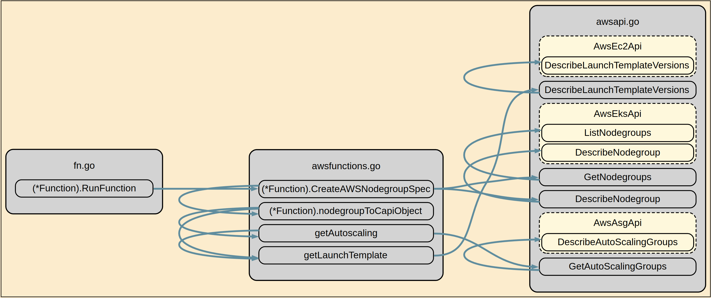

# function-describe-nodegroups

A [Crossplane] Composition Function which reads EKS nodegroup information and
uses that to create `MachinePool` anbd `AWSManagedMachinePool` objects.

In order to use this function as part of the [Composition], the composition
must be written to use pipeline mode. See the documentation on 
[Composition functions] to better understand how this is integrated

## Composition integration

This function is placed in the pipeline with a reference to the cluster object
for that composition.

This should be specified in your composition as follows, setting `clusterRef`
as appropriate for your composition.

```yaml
    - step: describe-nodegroups
      functionRef:
        name: function-describe-nodegroups
      input:
        apiVersion: describenodegroups.fn.giantswarm.io
        kind: Nodegroups
        metadata:
          namespace: crossplane
        spec:
          clusterRef: eks-cluster
```

## How it works

### AWS provider

This function performs a lookup against the AWS API for Nodegroups linked to 
the clustername referenced in `clusterRef`. It then iterates over that 
information and populates additional information from secondary lookups to the
EC2 API and Autoscaling API as appropriate.

Once all information is retrieved, this is then populated into a cluster-api
provider-aws `AwsManagedMachinePool` object, wrapped inside a 
`crossplane-contrib/provider-kubernetes` object and returned as a desired
resource to be reconciled and created by crossplane.

If the nodegroup was created with a `LaunchTemplate` then the function will
attempt to use that to build the specification for Cluster API. If no launch
template is found then the function tries to provide all required information
to Cluster Api so that it can formulate the nodepool(s).

To better understand what the function is doing, the following callgraph
highlights the general flow the function follows to obtain the relevant
information for building the CAPI objects.



### Azure provider

TBD

### GCP Provider

TBD

## Building

```shell
# Run code generation - see input/generate.go
$ go generate ./...

# Lint the code
$ docker run --rm -v $(pwd):/app -v ~/.cache/golangci-lint/v1.54.2:/root/.cache -w /app golangci/golangci-lint:v1.54.2 golangci-lint run

# testing
$ go test ./... -coverprofile=cover.out && go tool cover -html=cover.out
?       github.com/giantswarm/crossplane-fn-describe-nodegroups/pkg/composite/v1beta1   [no test files]
?       github.com/giantswarm/crossplane-fn-describe-nodegroups/pkg/input/v1beta1       [no test files]
ok      github.com/giantswarm/crossplane-fn-describe-nodegroups 0.028s  coverage: 74.9% of statements

$ docker buildx build .
```

## Known Issues

[Crossplane]: https://crossplane.io
[crossplane-cli]: https://github.com/crossplane/crossplane/releases/tag/v1.14.0-rc.1
[Composition]: https://docs.crossplane.io/v1.13/concepts/compositions
[Composition functions]: https://docs.crossplane.io/latest/concepts/compositions/#use-composition-functions
[RunFunctionRequest]: https://github.com/crossplane/function-sdk-go/blob/a4ada4f934f6f8d3f9018581199c6c71e0343d13/proto/v1beta1/run_function.proto#L36